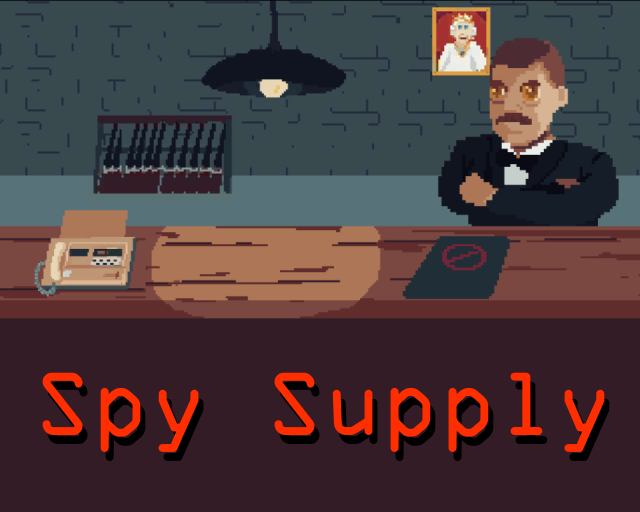

# Spy Supply

Ludum Dare 48 gamejam repo. Lojo = Lohja in Swedish, a place where we physically crunch.

## The game

Spy Supply sets the player as a quartermaster of a special operations agent. It's your task to pick the right equipment for the right task. Are you up for the challenge when the trouble gets deeper and deeper?

### Gameplay

The cames begins by receiving a mission document from the special agent. Your task is to get familiar with the mission and select correct equipment for the agent.

Once you have selected the items for the mission and sent the agent on the mission, you will receive a mission report about the mission outcome by fax. And you have familiriazed yourself with the mission debriefing report, you are given new mission.

Beware that you might run out of equipment, if used carelessly.

Made as part of the 48th Ludum Dare gamejam.

## Useful information for devs

- Unity version: 2019.4.20f1 (LTS)
- Game idea pitches & voting: https://docs.google.com/spreadsheets/d/1gas8KFC4dN4MRmJ-npv0Ni5dBpPzYABV-VvnHTMgQrI/edit?usp=sharing
- Ludum dare link: https://ldjam.com/events/ludum-dare/48/$233514
- itch.io link: https://martta.itch.io/spy-supply
